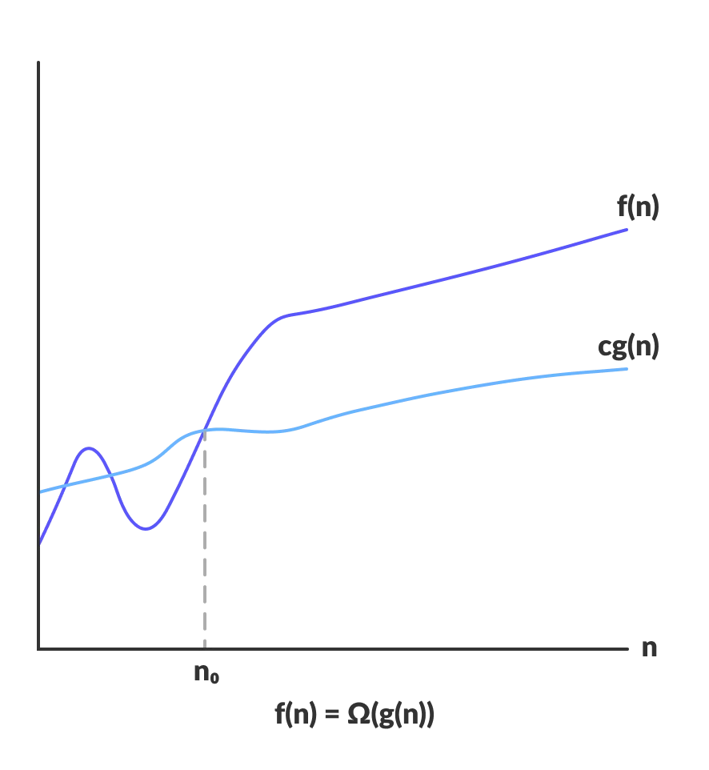

# **Time Complexity**

## Index

1. [Time Complexity](#1-time-complexity)

## 1. Time Complexity

- **시간 복잡도** 는 문제를 해결하는데 걸리는 시간과 입력의 함수 관계를 나타낸다.
- 즉, **입력값의 변화에 따라 연산을 실행할 때, 연산 횟수에 비해 시간이 얼만큼 걸리는가?** 를 나타낸 것이다.

## 2. 표기법

입력 크기 **n이 무한대로 커질 때** 시간 복잡도는 세 가지 방식으로 표기할 수 있다.

- **Big-O**
    - 최악의 경우를 나타낸다.
    - '어떤 입력이 주어지더라도 알고리즘의 수행시간이 얼마 이상 넘지 않는다' 라는 **상한(Upper Bound)** 의 의미
    - 보통 시간 복잡도는 최악의 경우로 나타낸다.
- **Big-Ω**
    - 최선의 경우를 나타낸다.
    - 가장 빠른 수행 시간을 분석하여 최적의 알고리즘을 찾는데 활용한다.
- **Big-Θ**
    - 평균의 경우를 나타낸다.
    - 입력의 확률 분포(일반적으로 균등 분포)를 가정하여 분석한다.

> 상각 분석
> - 일련의 연산을 수행하여 총 수행 시간을 합하고 이를 연산 횟수로 나누어 수행 시간을 분석
> - 상각 분석이 의미를 갖는 조건
    >
- 알고리즘에서 **적어도 두 종류의 연산** 이 수행
>   - 하나는 수행 시간이 길고 다른 하나는 짧아야 한다.
>   - 수행 시간이 긴 연산은 적게 수행되고 짧은 연산은 많이 수행되어야 한다.

### 2.1 Big-Omega

$Ω(g(n))$ = { $f(n)$: there exists positive constants $c$ and $n_0$ such that $0$ ≤ $cg(n)$ ≤ $f(n)$ for all $n$ ≥ $n_0$ }

## Reference

- [까만화면, [ 알고리즘 공부 ] 시간 복잡도(빅오Big-Oh, 빅오메가Big-Omega, 세타Theta)](https://bblackscene21.tistory.com/7)
- [HANAMON, [알고리즘] Time Complexity (시간 복잡도)](https://hanamon.kr/%EC%95%8C%EA%B3%A0%EB%A6%AC%EC%A6%98-time-complexity-%EC%8B%9C%EA%B0%84-%EB%B3%B5%EC%9E%A1%EB%8F%84/)
- [programiz, Asymptotic Analysis: Big-O Notation and More](https://www.programiz.com/dsa/asymptotic-notations)
