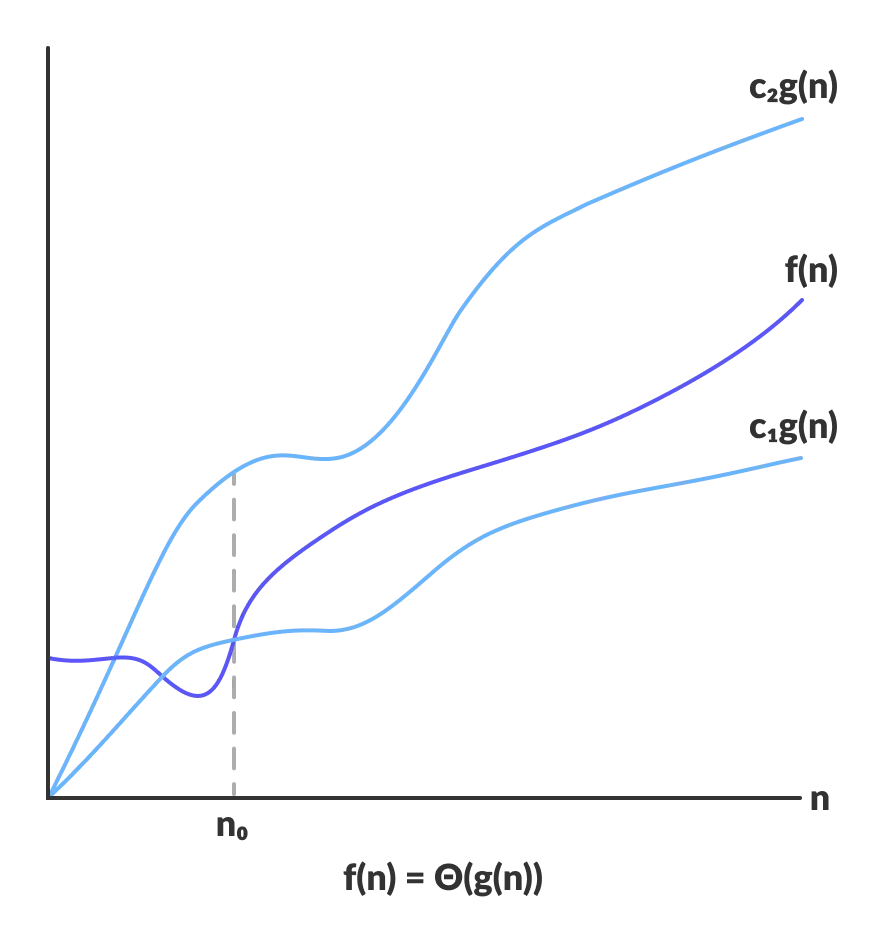
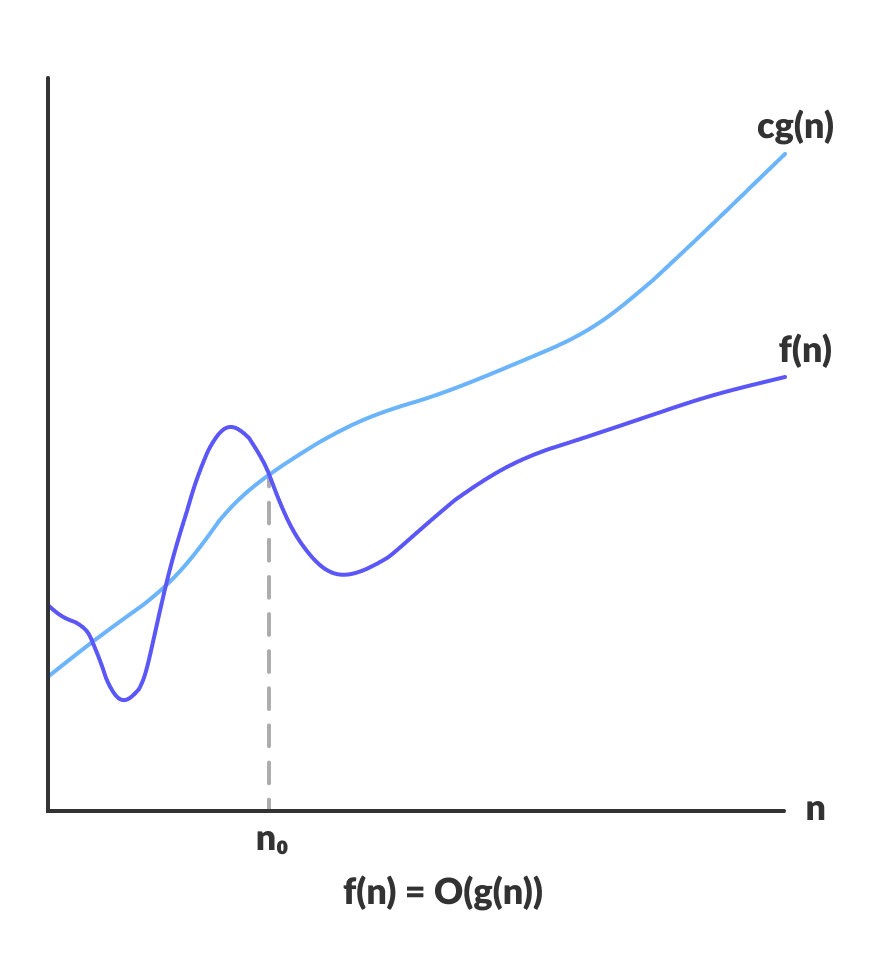
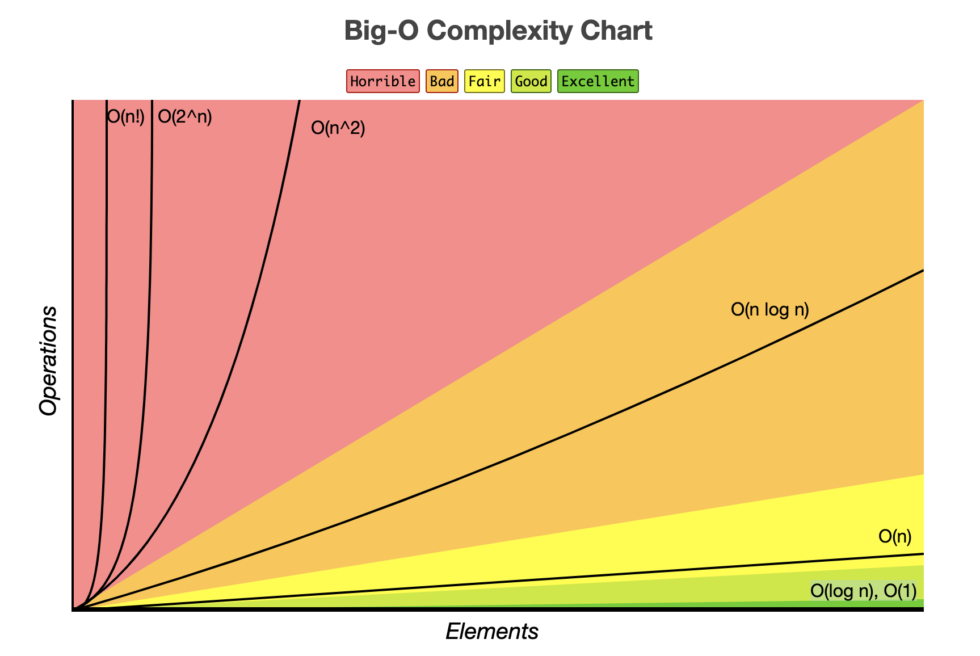

# **Time Complexity**

## Index

1. [Time Complexity](#1-time-complexity)
2. [표기법](#2-표기법)
    1. [Big-Omega](#21-big-omega)
    2. [Big-Theta](#22-big-theta)
    3. [Big-O](#23-big-o)
    4. [Big-O의 종류](#24-big-o의-종류)
        1. [O(1)](#241-o1)
        2. [O(log n)](#242-olog-n)
        3. [O(n)](#243-on)
        4. [O(n log n)](#244-on-log-n)
        5. [O(n^2)](#245-on2)
        6. [O(2^n)](#246-o2n)

- [Reference](#reference)

## 1. Time Complexity

- **시간 복잡도** 는 문제를 해결하는데 걸리는 시간과 입력의 함수 관계를 나타낸다.
- 즉, **입력값의 변화에 따라 연산을 실행할 때, 연산 횟수에 비해 시간이 얼만큼 걸리는가?** 를 나타낸 것이다.

## 2. 표기법

입력 크기 **n이 무한대로 커질 때** 시간 복잡도는 세 가지 방식으로 표기할 수 있다.

- **Big-O**
    - 최악의 경우를 나타낸다.
    - '어떤 입력이 주어지더라도 알고리즘의 수행시간이 얼마 이상 넘지 않는다' 라는 **상한(Upper Bound)** 의 의미
    - 보통 시간 복잡도는 최악의 경우로 나타낸다.
- **Big-Ω**
    - 최선의 경우를 나타낸다.
    - 가장 빠른 수행 시간을 분석하여 최적의 알고리즘을 찾는데 활용한다.
- **Big-Θ**
    - 평균의 경우를 나타낸다.
    - 입력의 확률 분포(일반적으로 균등 분포)를 가정하여 분석한다.

> 상각 분석
> - 일련의 연산을 수행하여 총 수행 시간을 합하고 이를 연산 횟수로 나누어 수행 시간을 분석
> - 상각 분석이 의미를 갖는 조건
    >

- 알고리즘에서 **적어도 두 종류의 연산** 이 수행

> - 하나는 수행 시간이 길고 다른 하나는 짧아야 한다.
>   - 수행 시간이 긴 연산은 적게 수행되고 짧은 연산은 많이 수행되어야 한다.

### 2.1 Big-Omega

- $Ω(g(n))$ = { $f(n)$: 모든 $n$ ≥ $n_0$ 에 대하여 $0$ ≤ $cg(n)$ ≤ $f(n)$ 을 만족하는 0보다 큰 상수인 $c$ 와 $n_0$ 이 존재한다. }
- 즉, $f(n) \ge cg(n)$ 을 만족하는 음이 아닌 정수 $n$ 과 0보다 큰 상수 $c$ 가 존재한다는 것이다.
- $4n^2$ , $2n^2$ , $5n^2 + 2n$ 등은 모두 $n^2$ 과 같거나 느리기 때문에 $Ω(n^2)$ 이다.

### 2.2 Big-Theta

- $Θ(g(n))$ = { $f(n)$: 모든 $n$ ≥ $n_0$ 에 대하여 $0$ ≤ $c_1g(n)$ ≤ $f(n)$ ≤ $c_2g(n)$ 을 만족하는 0보다 큰 상수 $c_1$ , $c_2$ 와 $n_0$
  이 존재한다. }
- 즉, $c_1g(n)$ ≤ $f(n)$ ≤ $c_2g(n)$ 을 만족하는 음이 아닌 정수 $n$ 과 0보다 큰 상수 $c_1$ , $c_2$ 가 존재한다는 것이다.
- $4n^2$ , $2n^2$ , $5n^2 + 2n$ 등은 모두 $n^2$ 과 같기 때문에 $Θ(n^2)$ 이다.
- $Θ$ 표기법은 $Ω$ 표기법과 $O$ 표기법의 교집합이다.

### 2.3 Big-O

- $O(g(n))$ = { $f(n)$: 모든 $n$ ≥ $n_0$ 에 대하여 $0$ ≤ $f(n)$ ≤ $cg(n)$ 을 만족하는 0보다 큰 상수 $c$ 와 $n_0$ 이 존재한다. }
- 즉, $f(n) \le cg(n)$ 을 만족하는 음이 아닌 정수 $n$ 과 0보다 큰 상수 $c$ 가 존재한다는 것이다.
- $4n^2$ , $2n^2$ , $5n^2 + 2n$ 등은 모두 $n^2$ 보다 같거나 빠르기 때문에 $O(n^2)$ 이다.
- 대체로 **최악의 경우도 고려하여 대비** 하는 Big-O 표기법을 사용하며 크게 아래와 같은 시간 복잡도들이 존재한다.

### 2.4 Big-O의 종류

#### 2.4.1 O(1)

.png)

- 입력값과 상관없이 일정한 시간이 걸리는 알고리즘

#### 2.4.2 O(log n)

.png)

- 한 번 탐색할 때마다 탐색 범위가 절반으로 줄어드는 알고리즘
- 이진 탐색이 대표적인 예시이다.
- O(1) 다음으로 가장 빠르다.

#### 2.4.3 O(n)

.png)

- 입력값의 크기에 비례하여 시간이 걸리는 알고리즘
- 선형 탐색이 대표적인 예시이다.
- n이 커질수록 앞에 계수의 의미가 사라지기 때문에 O(2n), O(3n) 등도 O(n)으로 표기한다.

#### 2.4.4 O(n log n)

- 선형 로그에 비례하여 시간이 걸리는 알고리즘
- 병합 정렬, 퀵 정렬 등이 대표적인 예시이다.

#### 2.4.5 O(n^2)

.png)

- 입력값의 제곱에 비례하여 시간이 걸리는 알고리즘
- 버블 정렬, 선택 정렬, 삽입 정렬 등이 대표적인 예시이다.

#### 2.4.6 O(2^n)

.png)

- 입력값의 지수에 비례하여 시간이 걸리는 알고리즘
- 재귀로 구현하는 피보나치 수열이 대표적인 예시

## Reference

- [까만화면, [ 알고리즘 공부 ] 시간 복잡도(빅오Big-Oh, 빅오메가Big-Omega, 세타Theta)](https://bblackscene21.tistory.com/7)
- [HANAMON, [알고리즘] Time Complexity (시간 복잡도)](https://hanamon.kr/%EC%95%8C%EA%B3%A0%EB%A6%AC%EC%A6%98-time-complexity-%EC%8B%9C%EA%B0%84-%EB%B3%B5%EC%9E%A1%EB%8F%84/)
- [programiz, Asymptotic Analysis: Big-O Notation and More](https://www.programiz.com/dsa/asymptotic-notations)
- [기록기록 우는 갈매기, [알고리즘] 점근표기법, asymptotic notation | 상한, 하한, 교집합](https://nolzaheo.tistory.com/3)