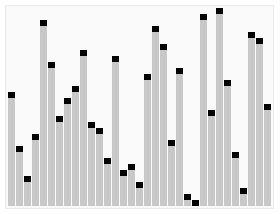
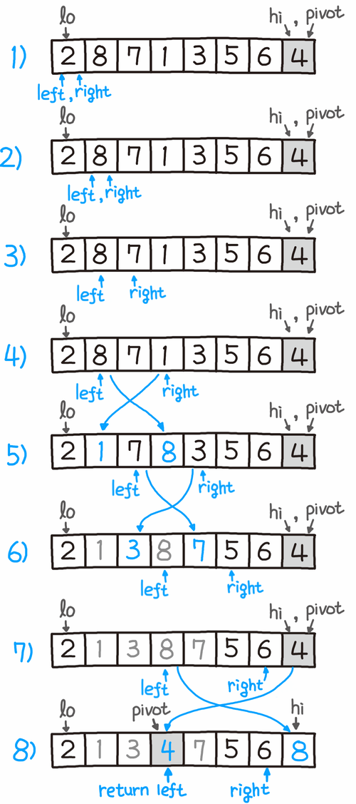
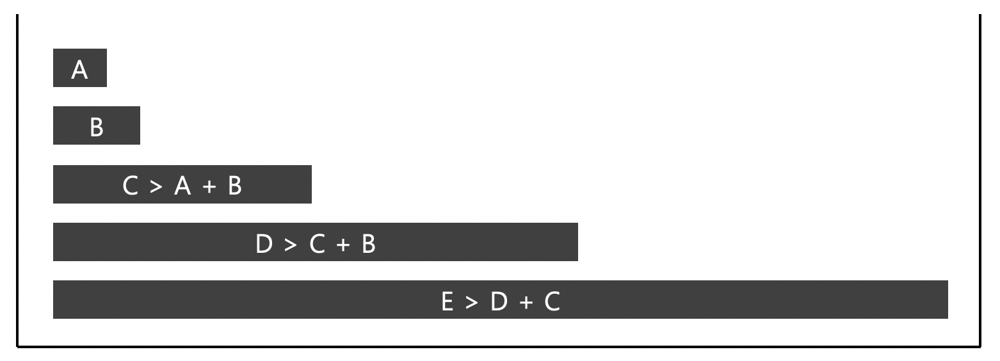
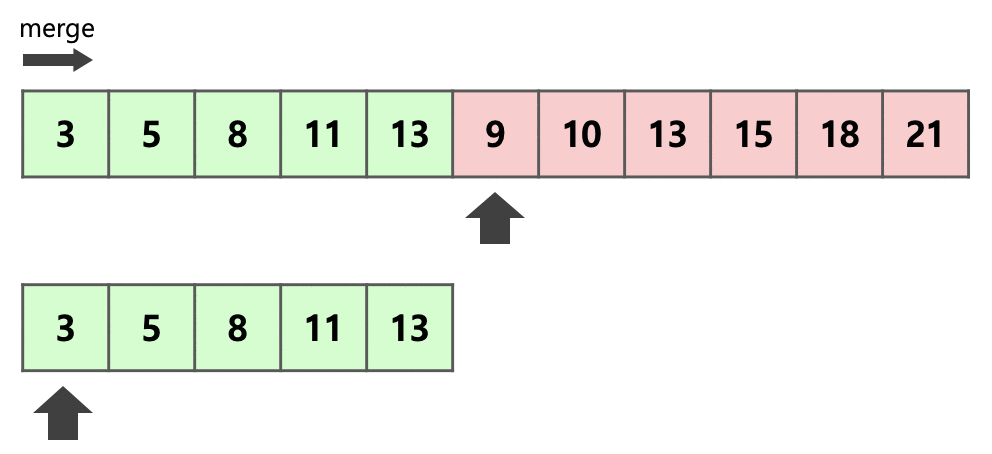
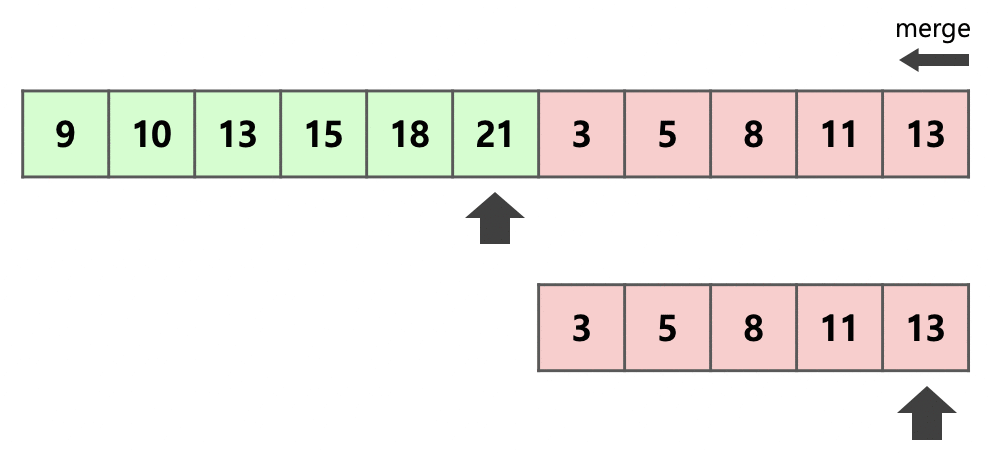
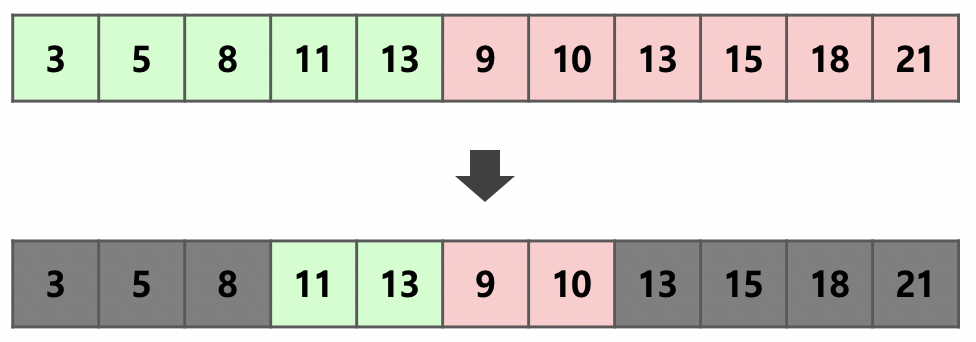
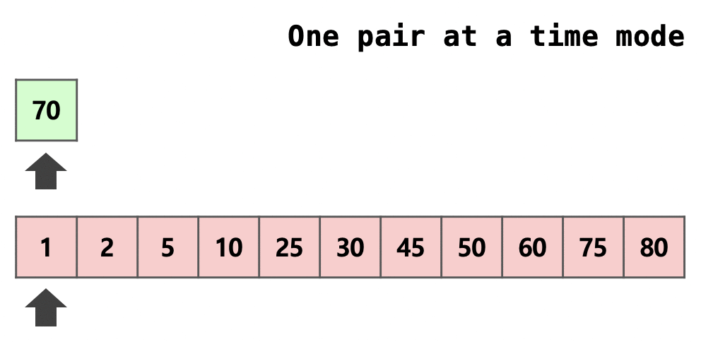

# Sort

## Index

1. [개요](#1-개요)
2. [정렬과 이진 탐색](#2-정렬과-이진-탐색)
3. [대표적인 종류](#3-대표적인-종류)
   1. [$O(n^2)$](#31-on2)
      1. [버블 정렬](#311-버블-정렬bubble-sort)
      2. [선택 정렬](#312-선택-정렬selection-sort)
      3. [삽입 정렬](#313-삽입-정렬insertion-sort)
   2. [$O(n \log n)$](#32-on-log-n)
       1. [병합 정렬](#321-병합-정렬merge-sort)
       2. [힙 정렬](#322-힙-정렬heap-sort)
       3. [퀵 정렬](#323-퀵-정렬quick-sort)
       4. [트리 정렬](#324-트리-정렬tree-sort)
4. [그 외의 정렬들](#4-그-외의-정렬들)
5. [Python의 경우](#5-python의-경우)
6. [Tim sort](#6-tim-sort)
    1. [새로운 정렬의 필요성](#새로운-정렬의-필요성)
    2. [참조 지역성 원리 관점에서](#참조-지역성-원리-관점에서)
    3. [Tim sort](#tim-sort)
    4. [Tim sort의 기본 원리](#tim-sort의-기본-원리)
    5. [Tim sort의 최적화 기법](#tim-sort의-최적화-기법)
7. [정렬 문제의 하한](#7-정렬-문제의-하한)

- [Reference](#reference)


# 1. 개요

정렬은 숫자, 문자(아스키 코드를 기준), 키 값을 기준으로 오름차순 혹은 내림차순으로 순서대로 나열하는 작업이다.
컴퓨터 작업에서 정렬은 대부분의 문제에서 필수적인데 이를 얼마나 효율적으로 해결하는가가 정렬 문제의 핵심이다.

데이터 정렬이 꼭 필요한 이유는 데이터를 탐색하기 위해서이다. 데이터가 정렬되어있지 않다면 순차탐색을 제외한 어떤 방법도 사용할 수 없다.
그러나 정렬이 되어있다면 이진 탐색을 사용하여 효율적으로 데이터를 찾을 수 있다.
삽입과 삭제가 자주 되는 자료의 경우 정렬에 더 많은 시간이 들어가므로 순차 탐색이나 해쉬탐색을 사용하기도 한다.
허나 대부분의 경우 삽입/삭제보다는 데이터를 조회하기에 정렬을 필요로 한다.

# 2. 정렬과 이진 탐색

정렬이 필요한 이유 중 큰 이유가 이진 탐색이다.
이진 탐색은 간단하게 현재 중간에 있는 값보다 찾고자 하는 값이 작다면 왼쪽만 탐색하는 방법이다.
이 방법은 아무리 최악의 경우라도 $\log n$의 성능을 보인다.
예를 들어 43억개의 정렬된 자료가 있따면 최악의 경우에도 32회면 값을 찾을 수 있다.

이렇듯 이진 탐색은 데이터를 조회하는데 핵심인 알고리즘이며 이를 위해 효율적인 정렬은 꼭 필요하다.

# 3. 대표적인 종류


## 3.1 $O(n^2)$

### 3.1.1 버블 정렬(Bubble sort)


버블 정렬을 앞에 있는 1, 2번 원소부터 비교하고 정렬하는 것을 $n - 1$, $n$번째 원소까지 반복하여 정렬한 뒤 다시 처음으로 돌아가 이번엔 $n - 2$와 $n - 1$번째 까지 정렬해서 최대 ${n(n - 1)}\over{2}$번 정렬한다. 한 번 돌 때마다 마지막 하나가 정렬되는 것이 거품이 올라오는 것 같다고 하여 거품 정렬이다.

정렬이 되어있는 상태가 아닌 대부분의 경우는 최악의 성능을 보이기 때문에 거의 사용하지 않는다. 그 대신 직관적이고 만들기가 쉬워서 정렬 알고리즘의 예시로 많이 보여준다.

```python
def bubble_sort(lst: list, len: int):
    for i in range(len - 1, 0, -1):
        for j in range(i):
            if lst[j] > lst[j + 1]:
                tmp = lst[j]
                lst[j] = lst[j + 1]
                lst[j + 1] = tmp
```

### 3.1.2 선택 정렬(Selection sort)


선택 정렬은 처음부터 끝까지 확인하고 가장 작은 것을 첫 번째로 옮긴 뒤, 두 번째에서 끝까지 확인하고 그 다음 작은 것을 두 번째로 놓아서 $n - 1$번 반복하는 방법이다. 어떻게 정렬되어있든지 일관성있게 ${n(n - 1)}\over{2}$에 비례하는 시간이 걸린다. 또한 버블정렬보다 두 배정도 빠르다.

### 3.1.3 삽입 정렬(Insertion sort)


삽입 정렬은 k번째 원소를 1부터 k - 1까지와 비교하여 적절한 위치에 삽입하고 그 뒤의 자료를 한 칸씩 뒤로 밀어내는 방식의 정렬이다. 평균적으론 $O(n^2)$중 빠른 편이지만 자료구조에 따라 뒤로 밀어내는데 걸리는 시간이 큰 경우나 정렬하고자 하는 순서와 다르게 정렬되어 있다면 매우 오래 걸린다.

그 대신 배열이 작거나 이미 정렬된 자료구조에서 새로운 자료를 삽입/제거하는 경우엔 상당히 효율적이다. 또한 구현이 매우 쉽다는 장점도 있다.

## 3.2 $O(n \log n)$

병합, 힙, 퀵 정렬은 평균적으로 $O(n \log n)$의 성능을 가진다. 최악의 상황에서보 병합, 힙 정렬은 $O(n \log n)$의 성능을 보이지만 퀵 정렬은 $O(n^2)$의 성능으로 안 좋아진다. 그러나 퀵 정렬은 평균적으로 세 개의 정렬 중 가장 빨라서 이를 조금 개량하여 최악의 경우가 거의 발생하지 않도록 코드를 짜서 사용한다. (힙정렬로 변환하는 등의 방법으로)

### 3.2.1 병합 정렬(Merge sort)


병합 정렬은 원소 개수가 1개 또는 0개가 될 때까지 두 부분으로 쪼개고 자른 순서의 역순으로 크기를 비교하며 병합해 나가는 방식의 정렬이다. 병합된 부분은 이미 정렬이 되어있기에 다시 비교하지 않아도 된다. 이는 대표적인 분할 정복 알고리즘이다.


성능은 퀵 정렬보다 전반적으로 떨어지고 데이터 크기만한 메모리가 더 필요하다는 단점이 있다. 그러나 데이터의 상태에 별 영향을 받지 않는다는 큰 장점이 있다. 이는 동일한 값이 있을 때에 기존 기준의 정렬순서가 유지되지 않을 수도 있는 힙, 퀵 정렬과 차별점을 두는 병합 정렬만의 장점이다.

### 3.2.2 힙 정렬(Heap sort)


힙 정렬은 다음과 같은 과정을 통해 정렬하는 방법이다.

1. 원소들을 전부 힙에 삽입한다.
2. 힙의 루트에 있는 값은 남은 수들 중에 최솟값(혹은 최댓값)을 가지므로 루트를 출력하고 힙에서 제거한다.
3. 힙이 빌 때까지 2의 과정을 반복한다.

선택 정렬과 거의 동일하며 가장 큰 원소를 뒤로 보낼 때, 하나씩 다 확인하느냐 힙으로 확인하느냐의 차이만 있다. 힙정렬은 추가적인 메모리가 전혀 필요하지 않으며 항상 $O(n \log n)$의 성능을 발휘하는 장점이 있다.

### 3.2.3 퀵 정렬(Quick sort)



퀵 정렬은 컴퓨터로 가장 많이 구현된 정렬 알고리즘 중 하나로 평균적인 상황에서 최고의 성능을 나타내는 정렬 방법이다.

방식은 적절한 피벗(원소 하나)을 정하고 피벗보다 작은 것은 앞으로 빼내고 그 뒤에 피벗을 옮겨 피벗보다 작은 것과 큰 것으로 나눈다. 그리고 각각에서 다시 피벗을 잡고 정렬해서 각각의 크기가 0 또는 1이 될 때까지 정렬하는 방식이다. 이렇게 피벗을 잡고 이보다 작은 원소들을 왼쪽으로, 보다 큰 원소들을 오른쪽으로 나누는걸 partition step이라고 하는데 퀵 정렬에서 이 방식을 어떻게 구현하느냐에 따라 성능이 많이 차이날 수 있다.



퀵 정렬의 가장 간단한 분할 알고리즘인 로모투 파티션을 도식화한 그림이다. 피벗은 가장 오른쪽 값을 기준으로 선택하고 이를 기준으로 2개의 포인터가 이동해서 오른쪽 포인터의 값이 피벗보다 작다면 서로 스왑하는 형태로 진행된다. left, right가 한 번 돈 결과를 보면 피벗은 중앙으로 이동하고 왼쪽은 피벗보다 작은 값, 오른쪽은 피벗보다 큰 값으로 분할된 것을 볼 수 있다. 이렇게 계속 분할하면서 left < right를 만족하지 않을 때까지 재귀로 반복하면 정렬이 끝난다.

만약 피벗을 최솟값이나 최댓값으로 계속해서 잡게된다면 최악의 경우인 $O(n^2)$의 성능을 가진다. 이는 힙 정렬이나 병합 정렬과 다른 퀵 정렬의 단점이다. 이를 방지하기 위해 피벗을 랜덤으로 잡는 것, 무조건 배열의 위치상 중간에 있는 값을 피벗으로 설정하는 것, 배열 중에 3개나 9개의 원소를 골라 이들의 중앙값을 피벗으로 잡는 것 등 여러 방법이 있다. 이 방법들을 사용해도 최악의 경우는 나올 수 있으나 그 경우가 극히 드물어진다. 또한 배열이 단순한 비교가 불가한 것이라면 중앙값을 찾는 과정 역시 오래 걸릴 수 있으므로 이럴 땐, 무작위 값이나 중간에 있는 값을 피벗으로 잡는 것이 좋다.

피벗을 랜덤으로 잡아도 최악의 경우를 모두 피할 수 있진 않기에 이를 보완하기 위해 특수한 상황이 나왔을 때, 다른 빠른 정렬 알고리즘을 섞어서 쓰는 하이브리드 퀵 소트도 많이 사용한다. 예를 들어 재귀 깊이가 일정 이상으로 깊어지면 힙 정렬 알고리즘을 사용하여 항상 $O(n \log n)$을 보장하는 방법 등이 있다.

파이썬은 퀵 정렬은 사용하지 않는데 퀵 정렬이 불안정 정렬이기 때문이다. 파이썬은 항상 안정(stable) 정렬을 사용한다.

### 3.2.4 트리 정렬(Tree sort)

트리 정렬은 이진 탐색 트리를 만들어 정렬하는 방식이다. 힙 정렬과의 차이는 정렬될 자료의 각 원소 크기에 따라 부모 노드의 왼쪽 자식이 되느냐, 오른쪽 자식이 되느냐가 갈린다는 점이다.

대략적인 진행은 다음과 같다.

1. 정렬된 배열의 맨 첫 값이 루트 노드가 된다.
2. 다음 값부터는 기존 노드 값과 비교한다. 루트 노드부터 출발하여 추가될 노드 값이 기존 노드 값보다 작은 경우는 왼쪽 자식을, 기존 노드 값보다 크거나 같을 경우는 오른쪽 자식을 찾는다. 내림차순이라면 반대로 기존 노드 값보다 크면 왼쪽, 작거나 같으면 오른쪽을 찾으면 된다.
3. 2번 과정에서 해당 방향의 자식 노드가 없으면 그 방향의 자식 노드로 추가한다. 있으면 그 방향의 자식 노드로 가서 크기를 비교하고 자식 노드가 있으면 2번 과정과 같은 방법으로 계속 해당 방향으로 이동하여 조사하고 없으면 그 방향의 자식 노드로 추가한다.
4. 모든 값이 노드로 추가되었으면 해당 트리를 중위 순회 방식(왼쪽 자식 - 자신 - 오른쪽 자식)으로 순회하여 그 순서대로 값을 정렬한다.

예를 들어 [4, 6, 1, 7, 5, 8, 2, 3]을 트리 정렬로 정렬하면 아래와 같은 그림으로 정렬된다. 또한 이를 중위 순회 방식으로 순회하면 무지개색 순으로 순회한다.


# 4. 그 외의 정렬들

그 외의 두 가지 이상의 정렬 방법을 합친 하이브리드 정렬들, 특수한 상황에서 $O(n)$의 성능을 가지는 정렬 등 다양한 정렬들이 있다. 이에 대해선 [이곳](https://namu.wiki/w/%EC%A0%95%EB%A0%AC%20%EC%95%8C%EA%B3%A0%EB%A6%AC%EC%A6%98#s-2.3) 을 참고하면 된다.

# 5. Python의 경우

python은 tim sort로 구현된 sort()(주어진 리스트를 정렬)와 sorted()(정렬된 새로운 리스트를 생성)라는 내장 정렬 함수가 있다. 두 개 모두 stable 정렬이며 다양한 옵션으로 원하는 정렬을 할 수 있다.

기본적으로 sort() 함수(sorted()도 동일)는 오름차순으로 정렬한다. 또한 이중 리스트를 정렬한다면 그 안의 값 중 가장 앞의 원소를 우선적으로 오름차순 정렬한다.

```shell
>>> a = [5, 4, 3, 2, 1]
>>> a.sort()
>>> a
[1, 2, 3, 4, 5]

>>> b = [[5, 2], [1, 3], [2, 20]]
>>> b.sort()
>>> b
[[1, 3], [2, 20], [5, 2]]
```

만약 내림차순을 원한다면 옵션으로 reverse=True를 설정하면 된다.

```shell
>>> a = [1, 2, 3, 4, 5]
>>> a.sort(reverse=True)
>>> a
[5, 4, 3, 2, 1]
```

만약 이중 리스트에서 앞 원소는 내림차순, 뒤 원소는 오름차순으로 정렬하고 싶다면 key 옵션을 이용하면 된다.

```shell
>>> a = [(6, 10), (2, 3), (4, 5), (1, 7), (6, 8), (9, 10)]
>>> a.sort(key=lambda x: (-x[0], x[1]))
>>> a
[(9, 10), (6, 8), (6, 10), (4, 5), (2, 3), (1, 7)]
```

문자열을 정렬하면 아스키 코드 값으로 정렬된다.

```shell
>>> word = ["ab", "efw", "a", "ee"]
>>> word.sort()
>>> word
['a', 'ab', 'ee', 'efw']
```

문자열 정렬을 응용하면 다음과 같은 정렬도 가능하다.

```shell
>>> a = ["2", "21", "23", "6", "10"]
>>> a.sort(key=lambda x: x * 3, reverse=True)
>>> a
['6', '23', '2', '21', '10']
```

이때, 위 옵션은 각 문자열의 3을 곱한 것을 기준으로 내림차순하겠다는 의미이다.
즉, ```["666", "222", "212121", "232323", "101010"]```을 기준으로 내림차순한다는 의미이다.

# 6. Tim sort

앞서 이야기했듯이 파이썬은 2002년 Tim Peters가 개발한 **Tim sort** 를 사용한다. Tim sort는 삽입 정렬과 병합 정렬를 결합하여 만든 정렬이다. 왜 새로운 정렬을 만들었고 두 정렬을 결합하여 얼마나 더 효율적이게 되었는지 확인해보자. ([파이썬으로 구현한 간략한 Tim sort](https://github.com/Kdelphinus/Python_study/blob/main/Baekjoon/solve_step_by_step/10_sort/TimSort.py))

## 새로운 정렬의 필요성

먼저 Tim sort 이전의 다른 정렬들을 다시 간단하게 살펴보자.


평균 성능과 메모리를 고려했을 때, 힙 정렬이 가장 좋은 알고리즘이지 않을까 생각이 든다. 허나 평균 시간 복잡도가 $O(n \log n)$ 에 대해 더 자세히 볼 필요가 있다.

시간 복잡도가 $O(n \log n)$ 이라는 말은 실제 동작 시간이 $C \times n \log n + \alpha$ 라는 의미이다. 상대적으로 작은 $\alpha$ 를 제외해도 앞에 $C$ 라는 상수가 곱해져 있어 이 값에 따라 실제 동작 시간에 큰 차이가 생긴다. 이 $C$ 라는 값에 큰 영향을 끼치는 요소 중 하나로 **알고리즘이 참고 지역성(Locality of reference) 원리를 얼나만 잘 만족하는가** 가 있다.

여기서 참조 지역성 원리란, CPU가 미래에 원하는 데이터를 예측하여 속도가 빠른 장치인 캐시 메모리에 담아 놓는데 이때의 예측력을 높이기 위하여 사용하는 원리이다. 쉽게 말하자면, 최근에 참조한 메모리나 그 메모리와 인접한 메모리를 다시 참조할 확률이 높다는 이론을 기반으로 캐시 메모리에 담아 놓는 것이다. 메모리를 연속으로 읽는 작업은 캐시 메모리에서 읽어오기 빠른 반면, 무작위로 읽는 작업은 메인 메모리에서 읽어오기에 속도의 차이가 있다.

## 참조 지역성 원리 관점에서


힙 정렬의 경우, 대표적으로 참조 지역성이 좋지 않은 정렬이다. 위 이미지에서 확인할 수 있듯이, 한 위치에 있는 요소를 해당 요소의 인덱스 두 배 또는 절반인 요소와 반복적으로 비교하기에 캐시 메모리에서는 미래에 원하는 데이터를 예측하기 매우 어렵다. 그렇기에 $C$ 는 상대적으로 다른 두 정렬보다 큰 값으로 정의된다.


이에 반해, 병합 정렬은 인접한 덩어리를 병합하기 때문에 참조 지역성의 원리를 어느 정도 만족한다. 그러나 입력 배열 크기만큼 메모리를 추가로 사용한다는 단점이 있다.


퀵 정렬에 경우, 피벗 주변에서 데이터의 위치 이동이 빈번하게 발생하기에 참조 지역성이 좋으며 메모리를 추가로 사용하지도 않는다. 실제로도 $C$ 의 값이 다른 두 정렬보다 작은 값으로 정의되어 있으며 평균 시간 복잡도도 셋 중에서 가장 빠르다고 알려져있다. 그러나 피벗을 선정하는 방법에 따라 최악의 경우 시간 복잡도가 $O(n^2)$ 이 될 수 있다는 단점이 있다.

이렇게 세 가지 정렬은 각자의 장단점이 존재했다. 그리고 이러한 장단점은 새로운 정렬에게 몇가지 요구 사항을 던져줬다.

- 상수 $C$ 의 값이 너무 커지지 않을 것
- 추가 메모리를 많이 사용하지 않을 것
- 최악의 경우에도 $O(n \log n)$ 으로 동작할 것

## Tim sort

Tim sort는 삽입 정렬과 병합 정렬을 결합한 알고리즘이다. 두 개의 알고리즘을 합쳐서 다음과 같은 성능을 얻게 되었다.

- 최선의 시간 복잡도: $O(n)$
- 평균 시간 복잡도: $O(n \log n)$
- 최악의 시간 복잡도: $O(n \log n)$
- 안정적
- 병합 정렬에 비해 적은 추가 메모리 사용

위와 같은 성능을 토대로 현재(2020년 문서 기준)는 2.3 이후 버전의 Python, Java SE 7, Android, Google chrome (V8), swift까지 많은 프로그래밍 언어에서 표준 정렬 알고리즘으로 채택되어 사용중이다.

## Tim sort의 기본 원리

Tim sort에서 왜 하필 병합 정렬과 삽입 정렬을 결합했을까?


삽입 정렬은 위와 같은 방법으로 동작한다. 인접한 메모리와 비교를 반복하기에 참조 지역성 원리를 매우 잘 만족하고 있다.

만약 삽입 정렬의 상수 $C$ 를 $C_i$ 라고 하고, $O(n \log n)$ 정렬 알고리즘 중 $C$ 값이 가장 작다고 알려진 퀵 정렬의 $C$ 를 $C_q$라고 할 때 작은 $n$ 에 대하여선 아래와 같은 식이 성립한다.

$$
C_i \times n^2 \lt C_q \times n \log n
$$

즉, 작은 $n$에 한해선 퀵 정렬보다 삽입 정렬이 빠른 것이다.

이러한 원리를 이용하여 전체를 작은 덩어리로 잘라 각각의 덩어리를 삽입 정렬로 정렬한 뒤, 병합하면 좀 더 빠르지 않을까 하는 아이디어가 tim sort의 기본 아이디어이다.

$2^x$ 개씩 잘라 각각을 삽입 정렬로 정렬하면 일반적인 병합 정렬보다 덩어리별 $x$ 개의 병합 동작이 생략되어, 병합 정렬의 동작 시간을 $C_m \times n \log n$ 이라 할 때, tim sort는 $C_m \times n(\log n - x) + \alpha$ 로 줄게 된다. 이때 $x$의 값을 최대한 크게 하고, $\alpha$의 값을 최대한 줄이기 위해 여러 가지 최적화 기법이 사용된다.

## Tim sort의 최적화 기법

### Run

먼저 $\alpha$를 유지하면서 $x$를 크게 하기 위해 $2^x$개씩 잘라 각각을 삽입 정렬로 정렬하여 덩어리를 최대한 크게 만들고, 이를 통해 병합 횟수를 최대한 줄이는 방법을 사용한다.


위 그릠의 배열은 $2^2$개씩 덩어리로 자른다고 가정한다. 맨 앞의 두 원소가 [10, 13]으로 증가하고 있으므로 이 덩어리는 증가하는 원소가 담긴 덩어리이다. 덩어리가 $2^2$이 될 때까지 뒤의 원소에 대해 삽입 정렬을 진행한다. 이어서 9와 15가 순차적으로 이 덩어리에 삽입되고 [9, 10, 13, 15]로 정렬된다. 여기서 멈추지 않고 최대한 덩어리를 크게 만들기 위해 뒤의 원소 또한 증가한다면 이 덩어리에 포함시킨다. 이 배열에서 [18, 21]의 경우, 이어지는 증가하는 원소들이므로 같은 덩어리로 묶는다. 이때는 삽입 정렬을 사용하지 않고 앞선 원소와 대소 비교만 하면 된다. 13부터는 새로운 덩어리로 묶는다. 덩어리의 첫 두 원소가 [13, 8]이므로 이 덩어리는 감소하는 방향으로 정렬을 진행한다. 앞의 네 개의 원소가 [13, 11, 8, 5]로 정렬되며 뒤의 [3] 또한 감소하기에 같은 덩어리에 포함될 수 있다는 것을 알 수 있다.

위 과정을 순서대로 다시 써보면 다음과 같다.

0. 배열을 $2^2$개씩 자른다고 가정한다.
1. 맨 앞 두 원소는 [10, 13]으로 증가하고 있으므로 증가가 되도록 덩어리를 만든다.
2. 뒤 이어 [9, 15]가 들어오고 이를 삽입 정렬을 통해 [9, 10, 13, 15]로 정렬한다.
3. 만약 덩어리 뒤에 값이 덩어리들의 값보다 크다면 계속해서 이어 붙인다.
4. 새로운 덩어리를 만들기 위해 앞의 두 원소인 [13, 11]을 덩어리로 만든다. 이는 감소하는 덩어리이다.
5. 뒤 이어 [5, 11]이 들어오고 이를 삽입 정렬을 통해 [13, 11, 8, 5]로 정렬한다.
6. 만약 덩어리 뒤에 값이 덩어리들의 값보다 작다면 계속해서 이어 붙인다.

이와 같이 덩어리의 첫 두 원소의 대소 관계로 증가/감소 덩어리로 정의하여 $2^x$개까지는 삽입 정렬을 진행하고, 그 이후 원소에 대해서 가능한 크게 덩어리를 만든다. 이런 덩어리를 **run** 이라고 부르며 이 때의 $2^x$를 **minrun** 이라 칭한다. 이는 실생활의 데이터의 특성상 완전한 무작위가 아니라 증가하거나 감소하는 부분이 많을 것이고 이 원소를 한 번에 묶기 위한 작업이다. 이미 정렬된 배열에서는 하나의 run만 생성되기에 Tim sort의 최선의 시간 복잡도는 $O(n)$이 된다.

증가하는 run과 감소하는 run은 다음과 같이 정의한다.

- 증가하는 run: $a_0 \le a_1 \le a_2 \le a_3 \le \cdots$
- 감소하는 run: $a_0 \gt a_1 \gt a_2 \gt a_3 \gt \cdots$

이후 감소하는 run은 뒤집어서 모든 run이 증가하는 run이 되도록 변환한다. 위의 수식에서 감소하는 run의 부등호에 등호가 없는 이유는 Tim sort는 안정적인 정렬이기에 뒤집을 경우 동일한 원소의 순서가 뒤바뀌기 때문이다.

Tim sort의 경우, 전체 원소의 개수를 $N$이라 할 때, minrun의 크기를 $min(N, 2^5 \sim 2^6)$으로 정의한다. 고정된 수로 정의하지 않는 이유는 더 느려지는 경우도 있기 때문이다. 예를 들어 $N$은 $1088$, minrun은 $32$일 경우, 전체 run의 개수는 최대 $1088 \div32=34=2^5+2$가 된다. 이 경우, 2개씩 병합하는 병합 정렬의 특성상 $2$의 거듭제곱이 아니기에 minrun이 $34$이고 run의 개수가 $32=2^5$인 경우보다 더 많은 시간이 걸린다. 따라서 Tim sort에서는 run의 개수가 2의 거듭제곱이 되도록 유동적으로 minrun 값을 정하여 사용한다.

### Binary Insertion sort

Tim sort에서 사용하는 삽입 정렬은 이진 삽입 정렬(Binary Insertion sort)이다. Binary라는 단어에서 유추할 수 있듯이, 삽입해야 할 위치를 찾을 때까지 비교하는 대신, 앞의 원소들은 모두 정렬되어 있다는 전제를 기반으로 이분 탐색을 진행하여 위치를 찾는다. 이분 탐색은 참조 지역성은 떨어지지만 한 원소를 삽입할 때 $O(n)$번의 비교 대신, $O(\log n)$번의 비교를 진행하기에 작은 $n$에 대하여 시간을 좀 더 절약할 수 있다.

### Merge

앞서 본 두 가지 방법으로 우리는 배열을 맨 앞 원소부터 훑으며 run의 크기가 minrun보다 작을 경우, Binary Insertion sort를 진행하고 증가하는 run인지, 감소하는 run인지에 따라 조건에 맞게 최대한 run의 크기를 키우고, 감소하는 run의 경우 뒤집어서 하나의 증가하는 run을 생성했다. 이제 효율적으로 run들을 병합할 차례이다.


위 그림은 병합 정렬을 설명할 때 봤던 그림이다. 병합 정렬이 두 덩어리를 병합하여 정렬된 하나의 덩어리로 만드는 과정에서 $n$의 추가 메모리와 두 덩어리의 크기의 합만큼 시간이 소요됨을 확인했었다. 그리고 안정성을 유지하기 위하여 인접한 덩어리에 대하여 병합을 진행했으며, 그 중에서도 비슷한 크기의 덩어리와 병합하여 효율성을 증대시켰다. 그러나 Tim sort에서는 각각의 run의 길이가 제각각이므로 병합 정렬과 같은 방법으로 진행하기엔 어려움이 있다. 그렇기에 우리는 비슷한 크기의 덩어리끼리 병합되도록 Tim sort를 구현할 필요가 있다.


Tim sort에서는 하나의 run이 만들어질 때마다 스택에 담아 효율적으로 병합을 진행한다. 이때, run을 스택에 넣을 때마다 스택의 맨 위의 세 run이 위 그림과 같이 두 조건을 만족해야 한다.


만약 위 그림처럼 두 조건을 만족하지 않는 상황이라면 $B$는 $A$와 $C$ 중 작은 run과 병합된다. 병합한 후에도 스택의 맨 위 세 개의 run이 조건을 만족하지 않으면 조건을 만족할 때까지 병합을 진행한다. 위 오른쪽 그림도 1번 조건을 만족하지 않으므로 이후 추가로 병합이 진행될 것이다.

이러한 규칙을 따라 스택에 쌓아 올릴 경우 어떠한 장점이 생기는가?



두 조건을 만족하는 스택을 그려보면 위의 그림과 같다. 이를 통해 장점을 정리하면 다음과 같다.

1. 스택에 들어있는 run의 수를 작게 유지할 수 있다.

   - 1번 조건을 통하여 다음과 같은 식이 성립한다.
   - $stack[i] \gt stack[i-1] + stack[i-2] \;\; (i \ge 2)$
   - 이는 피보나치 수열과 유사하다.
   - 각 run의 길이는 최소 비포나치 수보다 크므로 $n$이 1억일때도 스택의 크기는 $40$보다 작게 유지된다.
2. 비슷한 크기의 덩어리와 병합할 수 있다.

   - 조건을 만족하지 않을 때 실행하는 동작은 인접한 두 run을 모두 확인하여 그 중 가장 비슷한 run과 병합한다는 것이다.
   - 이는 최소한의 메모리를 이용하여 최고의 효율을 내기 위한 방법이다.

### 2 Run Merge

가장 효율적인 방법으로 병합할 두 run을 알아냈으니 이제 두 run을 병합 정렬과는 다른 효율적인 방법으로 병합할 차례이다. 이때 병합 정렬의 가장 큰 단점이었던 $n$의 추가 메모리를 사용하는 것도 해결해야 할 문제이다.



위의 그림은 이웃한 초록색 run $A$와 빨간색 run $B$를 하나의 run으로 병합하는 과정을 보여준다. 먼저 병합하기 전, 두 개의 run 중 크기가 더 작은 run $A$를 복사한다. 이후, 각 run의 시작 부분부터 크기 비교를 하여 작은 순서대로 앞을 채우면서 병합을 진행한다. run $B$의 원소가 병합될 때마다 화살표 또한 한 칸씩 앞으로 전진하므로 아직 병합되지 않은 run $B$의 원소 위치에 다른 수가 적힐 일이 없음을 알 수 있다.



run $B$의 크기가 더 작을 경우엔 반대로 진행하면 된다. $B$를 복사한 뒤, 각 run의 끝 부분부터 크기 비교를 하여 큰 순서대로 뒤를 채우며 진행한다. 두 경우 모두 같은 수인 13을 비교할 때, 안정적인 정렬을 고려하여 run $B$의 13이 먼저 들어가는 것을 확인할 수 있다.

이와 같이 두 run 중 크기가 작은 run을 담을 메모리가 필요하기에 병합을 진행할 때 최악의 경우 $n / 2$의 추가 메모리를 사용한다. 이는 병합 정렬과 같은 $O(n)$의 추가 메모리를 사용하는 것이지만 실질적으론 절반이 절약된다.



여기서 위 그림처럼 한 번 더 최적화를 진행한다. run $A,B$를 병합하기 전에 병합을 수행할 필요가 없는 구간을 먼저 계산한다. run $A$의 맨 앞 원소 [3, 5, 8]과 run $B$의 맨 뒤 원소 [13, 15, 18, 21]은 병합을 수행할 필요가 없다. 그렇기에 [11, 13]과 [9, 10] 두 부분만 병합을 진행하면 되기에 단 4번의 비교와 단 2개의 추가 메모리만으로 병합을 효율적으로 진행할 수 있다.

이때, 필요 없는 구간을 계산하는 과정을 이분 탐색으로 진행할 경우, run의 길이를 $k$라 하면, $O(\log k)$의 시간이 소요된다. 물론 필요 없는 구간이 없을 수도 있기에 시간만 소요하고 더 늦춰질 수도 있는 방법이다. 그러나 실생활 데이터에선 많은 시간을 절약할 수 있기에 Tim sort에서는 이분 탐색을 이용한 최적화 방법을 도입하고 있다.

### Galloping

마지막으로, 병합하는 과정에서 추가로 사용되는 **Galloping** 이라는 최적화 방법도 적용된다. 위에서는 두 run $A,B$를 병합할 때, 화살표가 가리키고 있는 두 원소를 대소 비교하여 병합을 진행했다. 여기에 '한 run을 계속해서 참조할 경우가 많지 않을까?' 라는 무작위적이지 않은 실생활 데이터의 특성을 이용하여 Galloping mode(질주 모드)일 경우, 하나의 run을 빠르게 참조하도록 동작한다.



위 그림은 이웃한 두 run을 병합하는 과정 중 일부를 잘라 표현한 것이다. 초록색으로 색칠된 부분은 run $A$의 일부이고, 빨간색으로 색칠된 부분은 run $B$의 일부이다. 처음에는 화살표가 가리키고 있는 두 원소를 비교하여 어느 run의 원소를 넣을지 정한다. 이 때의 방법을 **One pair at a time mode** 라 칭한다. 이때 run $B$의 원소가 $3$번 연속으로 병합된다면 **Galloping mode** 로 전환한다. 이 모드에서는 $1,2,4,8,\ldots$과 같이 $2^k$으로 뛰어 넘으며 대소 비교를 진행한다. 위 그림에서는 $10,30,75$와 비교하는 것을 볼 수 있다. $75$와 비교하면 $70 \lt 75$이므로 [45, 50, 60, 75]의 범위에서 이분 탐색을 진행하여 어느 위치까지 병합할지 결정한다. 이후 다시 하나의 run에서 연속적으로 병합되지 않을 경우, One pair at a time mode로 돌아가 다시 하나씩 비교를 진행한다.

실제 코드에서는 MIN_GALLOP번 연속으로 한 run에서 병합되었을 경우, Galloping mode로 전환하며 MIN_GALLOP는 전체 배열을 정렬하는 과정에서 Galloping mode에 들어가는 횟수가 많았다면 감소하고 아니라면 증가하여 좀 더 효율적으로 동작하도록 진행한다.

## 마무리

Tim sort는 병합 정렬을 기반으로 하되, 좀 더 효율적으로 run으로 나누고 제각기 다른 크기를 가진 run을 최대한 효율적인 방법으로 병합하여 실생활 데이터의 특성을 이용하여 여러 가지 최적화 기법을 도입한 정렬 알고리즘이다. 무작위 데이터에선 속도가 빠른 편은 아니지만 일정한 패턴이 있는 실생활의 데이터에 대해선 빠른 성능을 보여주고 안정적이며 최악의 경우에도 시간 복잡도가 $O(n \log n)$이기에 많은 언어에서 표준 정렬 알고리즘으로 사용하고 있다.

## 7. 정렬 문제의 하한

합병 정렬, 퀵 정렬, 버블 정렬, 선택 정렬, 삽입 정렬, 쉘 정렬, 힙 정렬 등의 공통점은 두 값을 비교하는 것에 기반하는 비교 정렬(Comparison sort)이라는 점이다.
비교 정렬에 한해서 문제를 풀기 위해 필요한 최소 비교 횟수는 어떻게 계산할 수 있는가.
이를 구하기 위해 시간복잡도의 하한(어떤 알고리즘도 하한보다 빠르게 해를 구할 수 없음을 의미)을 이용하여 계산할 수 있다.

### 7.1 n개의 숫자가 저장된 배열에서 최댓값을 찾는 문제의 하한

- 어떤 방법이더라도 각 숫자를 한 번씩은 비교해야 하기 때문에 적어도 $n - 1$ 번의 비교가 필요하다.

### 7.2 n개의 숫자를 비교 정렬하는데 필요한 최소 비교 횟수, 즉 정렬 문제의 하한

예를 들어 서로 다른 숫자 $x, y, z$ 에 대하여 정렬에 필요한 모든 경우의 비교는 아래와 같다.


각 leaf 노드 결과에 따라 정렬되어 결과가 저장된다.
위 같은 트리를 **결정 트리(decision tree)** 라고 하는데 아래와 같은 특징을 갖는다.

- leaf 노드의 개수는 $n!$ 개이다.
- 결정 트리는 이진 트리다.
- 결정 트리의 높이(비교 횟수)는 $log n!$ 보다 작을 순 없다.
- 결정 트리에는 정렬할 때 불필요한 내부 노드가 없다.

이때 [스털링 근사](https://en.wikipedia.org/wiki/Stirling%27s_approximation)에 의해 매우 큰 n에 대해서 $\ln n! = n \ln n - n + O(\ln n)$
이 성립한다.
따라서 어떤 비교 정렬도 $n \ln n - n + O(\ln n)$ 보다 적은 비교 횟수로 정렬할 수 없다.
그리고 이를 시간 복잡도로 나타내면 $O(n \log n)$ 이 된다.

## Reference

- [나무위키, 정렬 알고리즘](https://namu.wiki/w/%EC%A0%95%EB%A0%AC%20%EC%95%8C%EA%B3%A0%EB%A6%AC%EC%A6%98)
- [geeks for geeks, TimSort](https://www.geeksforgeeks.org/timsort/)
- [Naver D2, Tim sort에 대해 알아보자](https://d2.naver.com/helloworld/0315536)
- [wikipedia, Stirling's approximation](https://en.wikipedia.org/wiki/Stirling%27s_approximation)
- [nroo tistory, [Algorithm] 3-6. 정렬의 하한(lower bound)](https://ict-nroo.tistory.com/57)
- [팔만코딩경, cpp09 - mergeInsertionSort(ford-johnson algorithm)](https://80000coding.oopy.io/6880ebc0-acb3-4225-809f-37fc419adf71)
